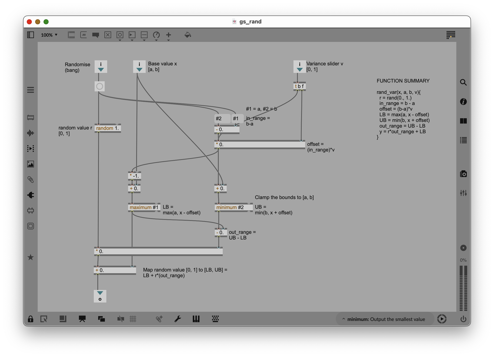
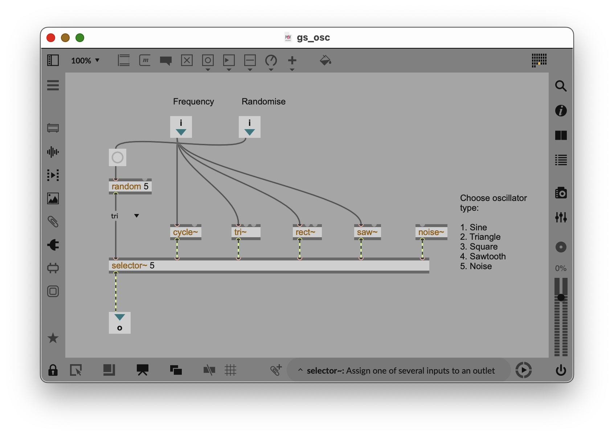
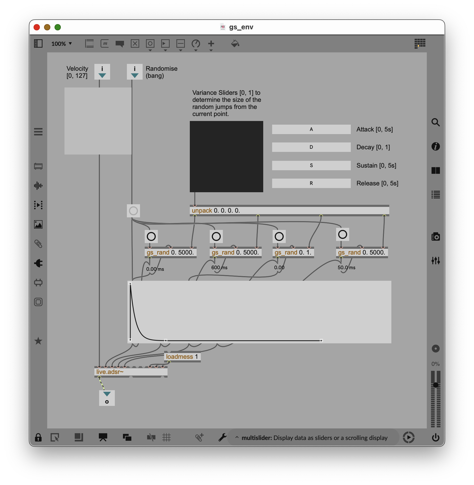
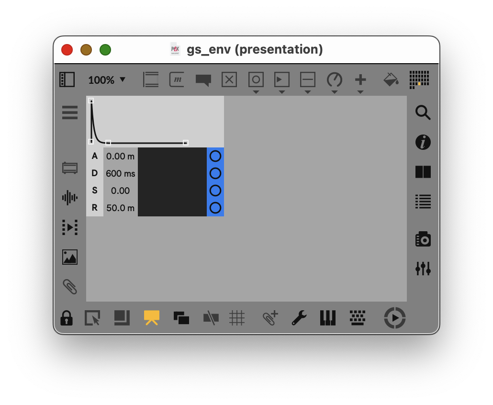
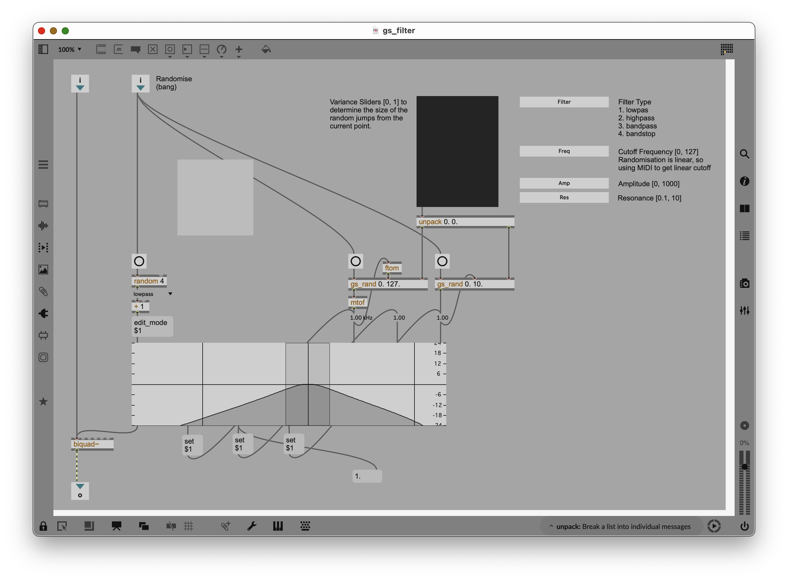
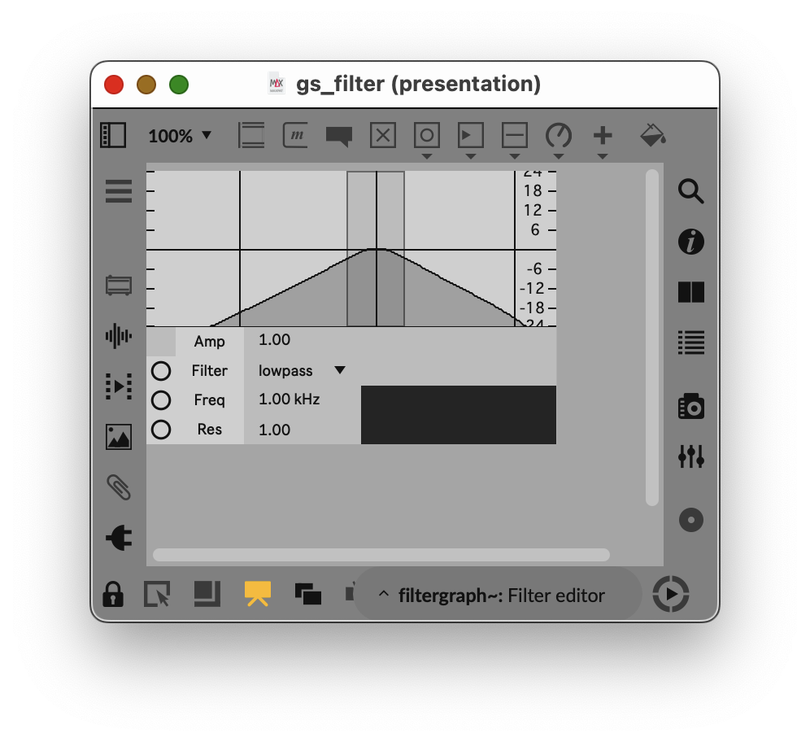

# Generative

A generative synthesizer built in Max for Live.

## Overview
[Write a brief description of what the synth sounds like and does.]
A generative synthesiser for FM synthesis built in Max for Live. Explore the different elements of frequency modulation and randomise to create interesting and complex sounds. 

## Installation
1. Download `Generative.amxd`.
2. Drag and drop it into a MIDI track in Ableton Live.

## Architecture

generative-synth/
├── .git/                       
├── .gitignore                  
├── README.md                   
├── Generative.amxd             # Frozen device for Ableton
├── generative_synth_DEV.amxd   # Unfrozen development file
├── patchers/                   # Subpatches
│   ├── gs_filter.maxpat
│   ├── gs_rand.maxpat
│   └── gs_osc.maxpat
└── media/                      
    ├── gs_filter_view.png
    └── gs_rand_view.png

The following subpatches:

### Controlled Randomness (`gs_rand.maxpat`)
On bang, `gs_rand` outputs a uniform random value centered around x, where variance controls the amount of possible variation. The output is guaranteed to be within [a, b]. Use low variance for subtle movement, and higher variance for jumps.

**Inputs**:
- randomise (bang): trigger new random number
- x [a, b]: base value in range 
- a, b: minimum and maximum bounds (set as patch arguments)
- variance [0, 1]: amount of random spread around x

### Oscillator (`gs_osc.maxpat`)
On each bang, gs_osc chooses one of five oscillator types: sine, triangle, square, sawtooth, or noise. The selected waveform is played at the incoming frequency and sent to the output.

**Inputs**:
- randomise (bang): randomly selects a waveform
- frequency: oscillator pitch in Hz

### Envelope (`gs_env.maxpat`)
On each bang, `gs_env` generates a new ADSR envelope by randomising its attack, decay, sustain, and release values. It shapes the incoming velocity with a new envelope on each trigger.

**Inputs**:
- randomise (bang): randomises the envelope shape
- velocity [0, 127]: note velocity
- attack [1ms, 5000ms]: attack time
- decay [1ms, 5000ms]: decay time
- sustain [0, 1]: sustain level
- release [1ms, 5000ms]: release time

<table>
  <tr>
    <td align="center">
      <strong>Patch</strong> 
      
    </td>
    <td align="center">
      <strong>Presentation</strong> 
      
    </td>
  </tr>
</table>

### Filter (`gs_filter.maxpat`)
On each bang, gs_filter updates the filter settings and routes the incoming signal through a biquad filter. The cutoff is controlled in MIDI-style units for a linear frequency response, while gain and resonance shape the character of the filter.

**Inputs**:
- randomise (bang): randomises the filter settings
- signal: audio input
- filter type: lowpass, highpass, bandpass, or bandstop
- frequency [0, 127]: cutoff frequency, mapped linearly from MIDI
- gain [0, 1000]: filter gain
- resonance [0.1, 10]: Q / resonance amount

<table>
  <tr>
    <td align="center">
      <strong>Patch</strong> 
      
    </td>
    <td align="center">
      <strong>Presentation</strong> 
      
    </td>
  </tr>
</table>
